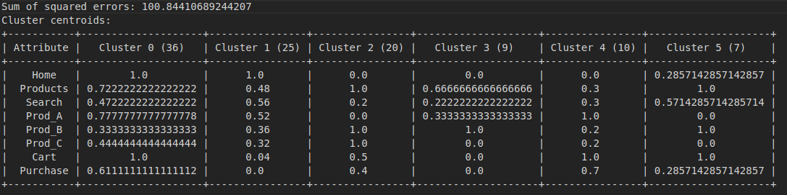
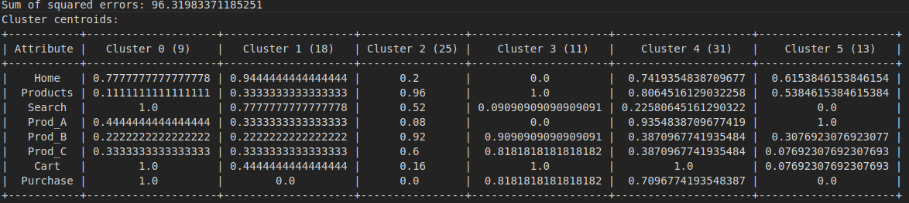
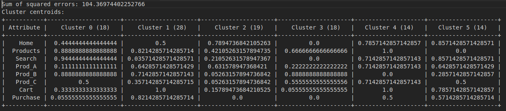

# LAB04 – Clustering

## Nội dung thực hiện báo cáo với ứng dụng WEKA

## Nội dung thực hiện cài đặt

Câu 2:

Khi đưa mẫu dữ liệu vào đầu file sessions.csv để gom cụm thì ta thấy mẫu dữ liệu này thuộc cụm 1

Câu 3:

Khi đưa mẫu dữ liệu vào đầu file sessions.csv để gom cụm thì ta thấy mẫu dữ liệu này thuộc cụm 2

Câu 4:

- Người dùng thông thường: (0,0,0,1,1,1,0,0) thuộc cụm 3

- Người dùng tập trung:  
(0,0,0,1,0,0,0,0)
(0,0,0,0,1,0,0,0)
(0,0,0,0,0,1,0,0)
thuộc cụm 2 hoặc 3

- Người dùng tìm kiếm: (0,0,1,0,0,0,0,0) thuộc cụm 2

Cả 3 nhóm đều có xư hướng thanh toán rất thấp

## Nội dung thực hiện báo cáo tìm hiểu giải thuật gom cụm

Improvement of K-means Clustering algorithm withbetter initial centroids based on weighted average  

Published in: 2012 7th International Conference on Electrical and Computer Engineering

[Link Paper](https://ieeexplore.ieee.org/document/6471633)

Hoặc [Ở đây](https://www.researchgate.net/publication/261233398_Improvement_of_K-means_clustering_algorithm_with_better_initial_centroids_based_on_weighted_average)

### Ý tưởng giải thuật cải tiến

Trong thuật toán cải tiến được thảo luận trong bài báo này, một phép đo mới được sử dụng để tìm ra điểm số trung bình của dữ liệu. Tác giả sử dụng một phương pháp thống nhất để tìm điểm thứ hạng bằng cách lấy trung bình thuộc tính của từng điểm dữ liệu, thứ sẽ tạo ra các tâm cụm theo phân phối của tập dữ liệu ban đầu. Một thuật toán sắp xếp được áp dụng cho điểm của từng điểm dữ liệu và được chia thành k tập con trong đó k là số cụm được xác định. Cuối cùng, giá trị trung bình gần nhất từ mỗi bộ được lấy làm tâm cụm ban đầu.

### Mã giả

1. Tính điểm trung bình của mỗi điểm dữ liệu  
    i) di=x1,x2,x3,..,xn  
    ii) di(avg)=(w1*x1+w2*x2+w3*x3+ ...... +wm*xm)/m (x = giá trị của thuộc tính, m = số lượng thuộc tính and w = trọng số để đảm bảo phân phối cụm hợp lý)
2. Sắp xếp dữ liệu dự vào điểm trung bình;
3. Chia tập dữ liệu thành k tập con;
4. Tính trung bình của mỗi tập con;
5. Chọn điểm dữ liệu gần trung bình nhất có thể làm tâm cụm ban đầu cho mỗi tập dữ liệu con

### Dẫn chứng dữ liệu thực nghiệm
